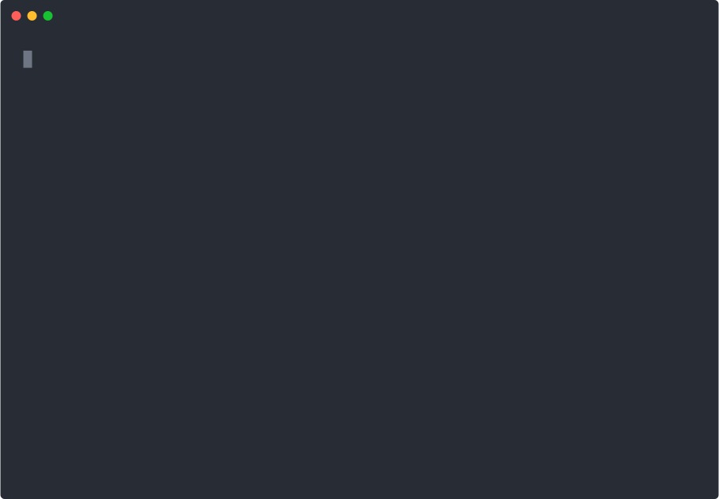

<p align="center">
  
</p>

<h1 align="center">Content Guard</h1>

<p align="center">
  <strong>A policy-driven secret and PII leak scanner for the moment before content goes public: Markdown docs, PR bodies, social drafts, and AI agent output.</strong>
</p>

<p align="center">
  <a href="https://content-guard.escoffierlabs.dev"><strong>Website</strong></a>
</p>

<p align="center">
  
  
  
  
  
</p>

Content Guard scans content for secrets, private infrastructure, and personal context, then blocks or redacts the leak before it ships. It runs at the publishing boundary, on the prose you are about to publish rather than only on a Git history, so a sloppy paste in a PR body, a blog draft, or generated agent output never reaches a public surface. Unlike commit-time secret scanners, it is content-aware: Markdown frontmatter, allow comments, JSON policy files, and a redaction format that leaves a clean, re-scannable file behind.

It takes the practical parts of a local content scrubber and the model-backed PII idea behind Privacy Filter, then turns them into one maintainable system with no required third-party dependencies.

<p align="center">
  
</p>

Scan a file, get a blocking report, redact in place, re-scan clean. The same engine runs as a pre-push hook, so the leaks above never reach a public remote in the first place.

## What it does

Content Guard is a secret-scanning and PII leak-detection tool for the content you publish, not just the code you commit. It checks Markdown docs, PR and issue bodies, social and blog drafts, generated AI agent output, and automation payloads against deterministic rules and optional model-based review, then reports one of four decisions per finding: block, redact, warn, or allow.

- Deterministic rules for infrastructure, secrets, and high-confidence PII patterns
- Optional OPF backend for model-based PII review and redaction
- Custom JSON policy files for private names, internal projects, unreleased plans, and environment-specific rules
- Blocking, warning, redaction, and allow decisions from one report format with a stable exit-code contract
- Markdown-aware scanning with frontmatter and inline allow-comment support
- Runs as a CLI, a pre-push Git hook, a PR-body guard, and an OpenClaw outbound-message plugin

The core package has no required third-party dependencies. OPF is optional and runs through its CLI when available.

## Quick start

Install from PyPI:

```bash
python -m pip install content-guard
```

Or from a local clone:

```bash
python -m pip install -e .
```

Scan, redact, or diff a file:

```bash
content-guard scan examples/sample.md --policy policies/public-content.json
content-guard redact examples/sample.md --policy policies/public-content.json
content-guard scan examples/sample.md --json
content-guard scan examples/ --policy policies/public-content.json
```

Scan a draft, get a blocking report, redact in place, and re-scan clean. Given a `draft.md` that pastes a live-looking API token into a release note:

```console
$ content-guard scan draft.md --policy policies/public-content.json
draft.md: 1 finding(s), blocked=true, changed=true
<!-- content-guard: allow api-key-assignment -->
  L3:5 BLOCK secret/api-key-assignment source=regex: 'token = "sk-live-abcdefghijklmnop0123456789"'
    Likely API key, token, or secret assignment.

$ content-guard redact draft.md --policy policies/public-content.json --in-place

$ content-guard scan draft.md --policy policies/public-content.json
Clean. draft.md: no findings.
```

A non-zero exit code means a blocking finding, which is what makes the same command usable in a pre-push hook or CI gate.

Use OPF if it is installed locally:

```bash
content-guard redact examples/sample.md --opf
```

By default, `--opf` looks for `~/.opf-venv/bin/opf`. Override it with:

```bash
CONTENT_GUARD_OPF_BIN=/path/to/opf content-guard scan file.md --opf
```

OPF can also be enabled from a policy file:

```json
{
  "backends": {
    "opf": {
      "enabled": true,
      "action": "warn",
      "device": "cpu"
    }
  }
}
```

## Policies

Policies are JSON so the project stays dependency-free. A policy can set default actions by category, override individual rules, and add private custom regex rules.

```json
{
  "name": "public-content",
  "defaults": {
    "infrastructure": "block",
    "secret": "block",
    "pii": "warn"
  },
  "rules": {
    "email": "warn"
  },
  "custom_rules": [
    {
      "id": "internal-hostname-example",
      "category": "infrastructure",
      "pattern": "\\\\binternal-host\\\\b",
      "replacement": "[redacted-host]"
    }
  ]
}
```

Actions:

- `block`: fail the scan, usually for publish gates
- `redact`: rewrite matching content
- `warn`: report without failing
- `allow`: ignore matching findings

### Bundled policies

Two bundled policies share the `infrastructure` category but treat it differently on purpose:

- `policies/public-repo.json`: for technical docs repos. It keeps `private-ipv4` (RFC 1918), secrets, PII, and `Co-authored-by` trailers as hard blocks, but downgrades `loopback-ipv4` (127.x), `localhost-port`, `localhost-bare`, and `port-reference` to warnings. README and CONTRIBUTING files often need to discuss `localhost`, named ports, and `127.0.0.1` for setup instructions. See [policies/public-repo.md](policies/public-repo.md) for the long-form rationale.
- `policies/public-content.json`: for blog posts and social drafts. It keeps the full infrastructure category at block because marketing surfaces have a higher leak risk and should not expose internal addresses or named ports.

## Allow comments

Use a local allow comment on the same line or directly above a line:

```md
<!-- content-guard: allow localhost-bare -->
This tutorial uses localhost as an example.
```

Use `content-guard: allow all` sparingly for examples where every finding is intentional.

For known-public literals that trip history scans (where inline comments cannot reach old commit diffs), add them to the private policy allowlist from the command line:

```bash
content-guard allow add "git@github.com" --note "SSH remote prefix, public by definition"
content-guard allow list
```

By default this edits `~/.config/content-guard/internal.json` (override with `--policy` or `CONTENT_GUARD_PRIVATE_POLICY`).

## PR and Git guards

PR bodies and public repository content are publishing boundaries too. Use stricter policies before copying generated summaries, dogfood notes, local test output, fixtures, or docs into public GitHub surfaces:

```bash
content-guard scan examples/pr-body.md --policy policies/pr-draft.json
content-guard diff examples/pr-body.md --policy policies/pr-draft.json
content-guard-pr examples/pr-body.md
content-guard-pr-prepare examples/pr-body.md --json
content-guard-publish-check --pr-body examples/pr-body.md --json
content-guard-n8n-advisory < payload.json
content-guard-n8n-validate --json
content-guard-git --policy policies/public-repo.json
content-guard-git --all-tracked --policy policies/public-repo.json
content-guard-commits --range origin/main..HEAD --policy policies/public-repo.json
```

See [docs/PR_DRAFTS.md](docs/PR_DRAFTS.md) and [docs/GIT_PUBLIC_REPO_GUARD.md](docs/GIT_PUBLIC_REPO_GUARD.md).

Use `content-guard-publish-check` as the practical local pre-publish wrapper. It prepares a sanitized PR body when `--pr-body` is provided, scans staged files, scans commit messages, and can optionally scan all tracked files:

```bash
content-guard-publish-check --pr-body pr-body.md --json
content-guard-publish-check --pr-body pr-body.md --all-tracked
```

PR body findings are advisory by default because the wrapper writes a sanitized body and prints `publish_body_file`. Staged file, commit message, and optional all-tracked blockers fail the command unless `--advisory-only` is set.

Use `content-guard-pr-prepare` when a later PR publishing step needs a stable sanitized body path:

```bash
content-guard-pr-prepare pr-body.md
gh pr create --body-file .content-guard/pr-drafts/pr-body.public.md
```

For local run-alongside testing against the legacy scrubber, see [docs/DOGFOOD_TEST_REPO.md](docs/DOGFOOD_TEST_REPO.md).

For n8n publish workflows, start with an advisory step that reports findings without mutating live publishes. See [docs/N8N_ADVISORY.md](docs/N8N_ADVISORY.md) and [docs/N8N_WORKFLOW_RECIPE.md](docs/N8N_WORKFLOW_RECIPE.md). Validate cloned workflow wiring with [docs/N8N_VALIDATION_PACK.md](docs/N8N_VALIDATION_PACK.md).

## OpenClaw plugin

Content Guard can also run as an OpenClaw outbound message plugin. The plugin lives in `openclaw-plugin/` and shells out to the same Python engine, so OpenClaw messages use the same policy model as publish gates.

The plugin is an example adapter. It is installed from source (clone this repo and point OpenClaw at `openclaw-plugin/`) and is not published to npm or any other registry. Only the `content-guard` Python package on PyPI is published.

See [docs/OPENCLAW_PLUGIN.md](docs/OPENCLAW_PLUGIN.md).

## Design notes

Privacy Filter influenced the optional model-backed PII layer, especially the idea that some personal data detection benefits from context. Content Guard does not copy Privacy Filter code. OPF integration is a subprocess adapter so the deterministic engine stays portable and maintainable.

The deterministic rules are intentionally conservative. Public publishing should fail loudly on infrastructure and secret leakage, while model findings are better treated as review signals until a local policy proves they are reliable enough to block.

## Why not gitleaks, trufflehog, or detect-secrets?

Those are excellent at what they do, which is scanning Git history and commit diffs for high-entropy strings and known credential shapes. Content Guard solves a different problem.

- **They scan code; Content Guard scans content.** gitleaks, trufflehog, and detect-secrets are built to find secrets in source repositories. Content Guard targets the prose you are about to publish: a PR body, a blog draft, a social post, a generated agent summary. A secret scanner does not look at the Markdown you paste into a release note.
- **Infrastructure and personal context, not only credentials.** Content Guard flags private hostnames, RFC 1918 addresses, internal project names, and PII alongside secrets, because a public blog post leaking your internal network layout is a real disclosure even when no API key is involved.
- **Policy-per-surface, not one global ruleset.** A docs repo needs to write `localhost` and `127.0.0.1` in setup instructions; a marketing post must not. Bundled policies treat the same `infrastructure` category as warnings for repos and hard blocks for public content, from the same engine.
- **Redaction, not just detection.** Content Guard rewrites the leak in place and leaves a re-scannable file, so the fix is part of the tool rather than a manual follow-up.

Run a credential scanner like gitleaks in CI for your commit history, and run Content Guard at the human publishing boundary. They are complementary.

## What Content Guard is not

- **Not a guarantee.** A clean scan means "no known pattern matched," not "safe to publish." It is a guardrail. Pair it with human review for anything sensitive.
- **Not a Git-history secret scanner.** It scans the content in front of you, not deep commit history. For repository history use a dedicated tool such as gitleaks or trufflehog.
- **Not a network or runtime DLP system.** It runs on files and text you hand it, not on live traffic.
- **Not a hosted service.** It is a local CLI and library. Nothing leaves your machine.

## Contributing and security

- [CONTRIBUTING.md](CONTRIBUTING.md): local setup, what lands easily, and the rule-change bar.
- [SECURITY.md](SECURITY.md): how to report a bypass privately. For a guard, the bug that matters most is content that should have been flagged but was missed.
- [CODE_OF_CONDUCT.md](CODE_OF_CONDUCT.md) and [CHANGELOG.md](CHANGELOG.md).

## License

Apache-2.0. See [LICENSE](LICENSE).
